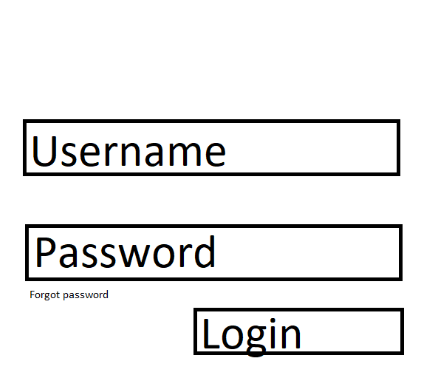
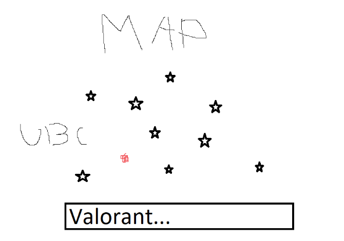
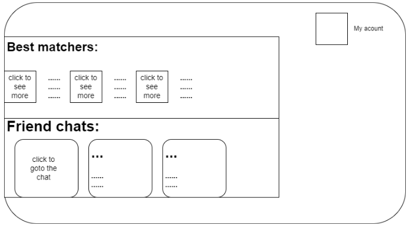

# Group9-Project
## FINAL PROJECT REPORT

# Project Description

An engaging gaming social network platform, with a robust authentication and user account system for profile customization, friend interactions, and game selection. Including real-time communication and gaming requests, and functionalities such as viewing friends on maps, user matching results, and real-time notifications.

## Features & Technical Highlights

### 1. Authentication System
- **Framework/Tools:** Firebase and React-Router
- Allows users to register and log in.
- Provides access to private routes based on authentication context.

### 2. Account Management System
- **Backend:** Express and Mongoose
- Stores user profiles, game lists, and friends in MongoDB.
- Enables users to:
  - Modify their profile.
  - Add favorite games.
  - Manage a server-side game list.
- Integration with Firebase for private route access post-authentication.
- Friend management:
  - Sending, accepting, ignoring friend requests.
  - Viewing friends' profiles and activities.
- Query engine for recommending accounts based on user information and matching criteria.

### 3. Real-time Communication
- **Technology:** socket.io
- Provides real-time messaging and notifications.
- Allows direct messaging.
- Stores message histories in MongoDB.

### 4. Client-Side Application
- **Frameworks/Tools:** React, Redux, Bootstrap, Leaflet map
- Manages client-side info with reducers, thunks, and services.
- Features:
  - Displaying friend requests and friends' profiles.
  - Showcasing friends' locations on a map.
  - User input for matching, with server results paginated.
  - Profile and game list viewing/modification.
  - Chat histories and real-time messages.

### Minimal requirements:
- [x] 1. Implementing an authentication system with Firebase that can let users register or log in and then(if passing the authentication) access their private routes.
- [x] 2. Implementing an account system integrated with Firebase that restores users' information in database, and allows users to send friend requests, accept requests, ignore requests and remove friends.
- [x] 3. Implementing a profile and a game list for every account. Users are able to edit their profile and game list and view others.

### Standard requirements:
- [x] 1. Implementing a query system that computes the match levels of different accounts in the database, which could later be removed or sending matching requests from the user.
- Select from user's locations, games played, gaming platform and gender and filter users from backend with satisfied conditions.
- [x] 2. Be able to communicate with friends by sending direct messages.
- [x] 3. Display the user and this user's friends location on a map.
- [x] 4 .Be able to select games from a list of games provided by the server, stored as part of user information.

### Stretch requirements:
- [ ] 1. Link games to account, display in-game achievement?
- [x] 2. Make messaging system respond in real time using WebSokect.
- [ ] 3. Send an invitation to everyone within an outlined area for people to join a users party/game
- [x] 4. Variable avatars for users to select, and show users avatar on matching, map, friend list and chat.
- [x] 5. Be able to add a new game to the list. Having search functionality to find a game in a large game list.

### Tech from units 1-5
Unit 1 – HTML, CSS, JS

Unit 2 – React & Redux

Unit 3 – Node & Express

Unit 4 – MongoDB

Unit 5 – Builds and Deployment
### Above and Beyond

### Next Steps

### List of Contributions
Jasper: Worked on the Map part of the web application which includes setting up the map api, creating the component, managing the redux of the data displayed on the map and calling the backend for everything map needs. Also dealth with all of the deployment and any issues that deployment presented. 
   Shawn: Implemented the details of update page and matching page both on frontend and backen, and made some user friendly designs like one button to retrieve current location, and showing some information for potential matches. 
   Cheryl: Worked on the layout and implementation for home page, profile page, update profile page and game selection page. Created API endpoints for games on the server side. Utilized React components to refactor the code and enhance its clarity.

### Task breakdown
1. Choose proper database and implement database connector to the back-end.
2. Implement account system on back-end: store update account info in database.
3. Implement account system on front-end: log and register function and secured html structure with accounts.
4. Implement filtering algorithm on back-end.

### Prototypes 

Log-in page:

Map page:

Main page:

